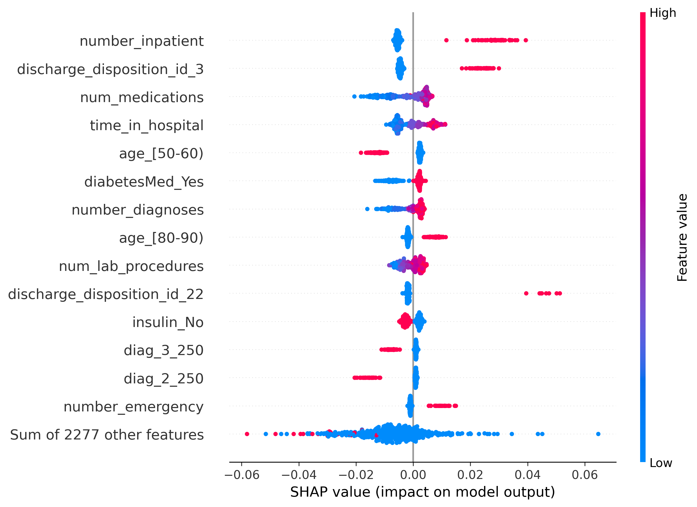

# Predicting 30-Day Hospital Readmission in Patients with Diabetes: Random Forest + SHAP

This project predicts whether a patient with diabetes will be readmitted to hospital within 30 days of discharge, and uses SHAP (SHapley Additive exPlanations) to show which patient characteristics the model relies on.

**Main findings**

- Readmission is hard to predict from this data. The Random Forest reached an AUC of **0.633**, and a simple logistic regression baseline reached **0.624**, so the more complex model offered no clear gain.
- The most influential features were the number of prior inpatient visits, discharge to a skilled nursing facility, the number of medications, and length of stay.
- These results are associations. SHAP shows what the model relies on, not what causes readmission.

The full write-up is in [`paper/`](paper/).

## Data

[Diabetes 130-US Hospitals for Years 1999–2008](https://archive.ics.uci.edu/dataset/296/diabetes+130-us+hospitals+for+years+1999-2008) from the UCI Machine Learning Repository (Strack et al., 2014): 101,766 inpatient encounters from 130 US hospitals.

The data are **not included** in this repository. See [`data/README.md`](data/README.md) for download instructions.

## Method

1. **Cohort selection.** Kept only each patient's first encounter (101,766 → 71,518 patients), then excluded patients who died or were discharged to hospice (→ 69,973 patients).
2. **Outcome.** Readmitted within 30 days (1) versus not readmitted or readmitted after more than 30 days (0). About 9% of patients are in the positive class.
3. **Features.** Removed `weight`, `payer_code` and `medical_specialty` (extensive missing values). Admission, discharge and diagnosis fields were one-hot encoded, giving 2,291 predictor columns.
4. **Models.** Random Forest (100 trees, max depth 10, balanced class weights) and a logistic regression baseline with balanced class weights on standardised features. Stratified 80/20 train–test split, random seed 42.
5. **Interpretation.** SHAP TreeExplainer on a random sample of 500 test patients.

## Results

Test set: 13,995 patients, 1,255 of them readmitted within 30 days.

| Model | AUC | Precision (readmitted) | Recall (readmitted) |
|---|---|---|---|
| Random Forest | 0.633 | 0.14 | 0.50 |
| Logistic regression (baseline) | 0.624 | 0.14 | 0.53 |

Performance is modest. Because only about 9% of patients are readmitted, overall accuracy is not an informative measure here.



*Each point is one patient. Horizontal position shows how much a feature raised or lowered that patient's predicted readmission risk; colour shows the feature's value (for yes/no features, red means the patient has the characteristic).*

Features associated with higher predicted risk include more prior inpatient and emergency visits, more medications, longer hospital stays, more recorded diagnoses, and discharge to a skilled nursing or rehabilitation facility. Admission type did not appear among the leading features.

## Repository structure

```
├── README.md
├── LICENSE
├── requirements.txt
├── notebooks/
│   └── readmission_analysis.ipynb
├── figures/
│   └── shap_beeswarm.png
├── data/
│   └── README.md
└── paper/
    └── Readmission_SHAP_paper.pdf
```

## How to run

1. Download the dataset (see `data/README.md`) and place `diabetic_data.csv` in the folder where you run the notebook, or adjust the path in the first cell.
2. Install the required packages and open the notebook:

```bash
pip install -r requirements.txt
jupyter notebook notebooks/readmission_analysis.ipynb
```

Developed with Python 3.12.12, scikit-learn 1.7.2, SHAP 0.52.0, pandas 2.3.3 and matplotlib 3.10.6.

## Limitations

- The data are from 1999–2008 and may not reflect current practice.
- Performance was evaluated on a single train–test split, without cross-validation or hyperparameter tuning.
- SHAP was computed on a sample of 500 patients, so rare categories are sparsely represented.
- Laboratory measures in the dataset are largely missing, so the comparison between utilisation and laboratory variables should be read with care.
- Patients with no A1C or glucose test share an all-zero encoding with one reference result category, so "not tested" is not encoded separately.
- The explanations were not reviewed by clinicians, and the results do not establish causal effects.

## Reference

Strack, B., DeShazo, J. P., Gennings, C., Olmo, J. L., Ventura, S., Cios, K. J., & Clore, J. N. (2014). Impact of HbA1c measurement on hospital readmission rates: Analysis of 70,000 clinical database patient records. *BioMed Research International, 2014*, 781670.

## Author

Katlo Kgakishi

## License

[MIT](LICENSE)
